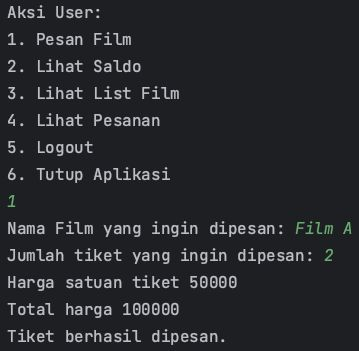

# Laporan Ujian Akhir Praktikum

## Data Mahasiswa
Nama: Humaam Ahmad Yaasiin
 
NIM: 235150707111049

## Kasus Pengguna

### Pesan Film
Pengguna berhasil memesan film:
 

Film tidak ditemukan:
 

Stok film tidak tersedia:
 

Saldo pengguna tidak cukup: 
 

### Lihat Saldo
Saldo pengguna sebelum memesan film:
 

Saldo pengguna setelah memesan film:
 

### Lihat List Film

List film sebelum dipesan oleh pengguna:
 

List film setelah dipesan oleh pengguna:
 

### Lihat Pesanan

List pesanan sebelum pengguna pesan:
 

List pesanan setelah pengguna pesan:
 

## Kasus Pengelola

### Tambah Film

Tambah film berhasil:
 

Tambah film gagal:
 

### Lihat List Film

List film sebelum ditambahkan oleh pengelola:
 

List film setelah ditambahkan oleh pengelola:
 
